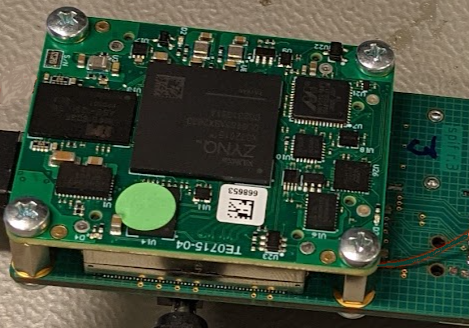

spif: SpiNNaker peripheral interface
====================================

This repository contains an FPGA design to interface event-based peripherals, such as event cameras or DVS, to a SpiNNaker system through a High-Speed Serial Link (HSSL).

The repository contains two designs that target different FPGA platforms:

- `spif_on_zu9eg` -- Xilinx ZCU102 development board (ZYNQ Ultrascale+)
- `spif_on_7z015` -- Trenz Electronic TE0715-04-15 board (ZYNQ 7000).
- `spif_common`   -- contains the modules that are used in both designs.

The designs are built on top of [spI/O](https://github.com/SpiNNakerManchester/spio), the library of FPGA designs and reusable modules for I/O and internal connectivity in SpiNNaker systems.

The designs were implemented and verified using `Xilinx Vivado version 2019.2`.

Both platforms connect to the SpiNNaker system using a SATA cable and the spiNNlink protocol used in SpiNNaker systems for board-to-board interconnect.

The following open-access publication describes the use of spif in a real-time closed-loop control system:

JP Romero Bermudez, LA Plana, A Rowley, M Hessel, JE Pedersen, S Furber and J Conradt, "A High-Throughput Low-Latency Interface Board for SpiNNaker-in-the-loop Real-Time Systems", in ICONS '23: Proceedings of the 2023 International Conference on Neuromorphic Systems, Article No.: 28, Pages 1–8, doi: [10.1145/3589737.3605969](https://doi.org/10.1145/3589737.3605969)

spiNNlink
---------

spiNNlink is the high-speed, serial (hss) board-to-board SpiNNaker interconnect.  It is implemented on three Spartan-6 FPGAs present on the SpiNN-5 board and is designed to provide transparent board-to-board connectivity. The details of the spiNNlink protocol are described in the [spiNNlink Frame Transport Specification](http://spinnakermanchester.github.io/docs/spiNNlink_frame_transport.pdf).

Verilog code for the spiNNlink modules is located in [spio/modules/hss_multiplexer](https://github.com/SpiNNakerManchester/spio/tree/master/modules/hss_multiplexer). See [spio/designs/spinnaker_fpgas](https://github.com/SpiNNakerManchester/spio/tree/master/designs/spinnaker_fpgas) for an example of how to use spiNNlink.

The following open-access publication describes the SpiNNlink specification and implementation:

LA Plana, J Garside, J Heathcote, J Pepper, S Temple, S Davidson, M Luján and S Furber, *spiNNlink: FPGA-Based Interconnect for the Million-Core SpiNNaker System*, in IEEE Access, vol. 8, pp. 84918-84928, 2020, doi: [10.1109/ACCESS.2020.2991038](https://doi.org/10.1109/ACCESS.2020.2991038).

Authors
-------

The designs in this repository are largely the work of:

* LA Plana (The University of Manchester)

with input from J Conradt (KTH), JE Pedersen (KTH), JP Romero Bermúdez (KTH), AG Rowley (UManchester), S Davidson (UManchester) and O Rhodes (UManchester).

Acknowledgments
---------------

The designs in this reposiory were developed as part of a collaboration between the Advanced Processor Technologies group at The University of Manchester and the Neurocomputing Systems Lab at KTH Royal Institute of Technology, Stockholm.

The SpiNNaker Project was supported by the EU ICT Flagship Human Brain Project under Grant H2020-945539. LA Plana was supported, in part, by the RAIN Hub, which was funded by the Industrial Strategy Challenge Fund, part of the government’s modern Industrial Strategy. The fund was delivered by UK Research and Innovation and managed by EPSRC under grant EP/R026084/1.

We gratefully acknowledge these institutions for their support.
